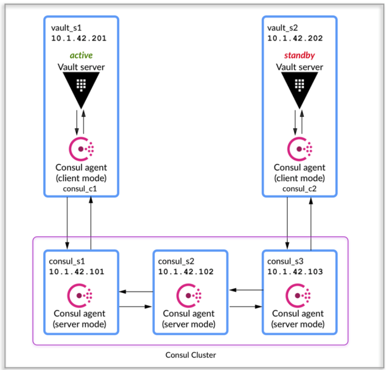
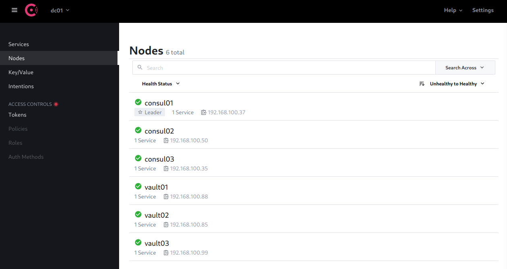

# terreform-vault-consul-ha

## Pré requisitos

- [terraform](https://www.terraform.io/downloads)
- [packer](https://www.packer.io/downloads)
- [make](https://cmake.org/)
- [docker](https://docs.docker.com/engine/install/)
- [python](https://www.python.org/)
- [kvm](https://www.redhat.com/pt-br/topics/virtualization/what-is-KVM)

OBS: python precisa estar na versão 3.9.10, última versão do python 3.9. Tive alguns problema no python 3.10.2

Aconselho utilizar [pyenv](https://github.com/pyenv/pyenv-installer) para instalar outras versões do python sem comprometer o python do sistema, já existe um arquivo .python-version que o pyenv utilizar para configurar a versão 3.9.10

O que o projeto irá criar:

Packer irá criar uma máquina virtual utilizando a imagem mais atual do [rockylinux](https://rockylinux.org/about)

O terraform irá provisionar seis máquinas virtuais onde três delas serão destinadas para o [vault](https://www.vaultproject.io/docs/what-is-vault) e as outras três serão destinadas para o [consul](https://www.consul.io/docs/intro)

Arquitetura do ambiente foi baseada na [documentação](https://learn.hashicorp.com/tutorials/vault/ha-with-consul) da hashicorp:



Obs: Utilizamos três instancias do vault ao invés de uma.

Todas as informações das máquinas virtuais estão no arquivo .env:

```
ROJECT_USERNAME=root
PROJECT_PASSWORD=rockylinux
PROJECT_DOMAIN=hashicorp.br

PACKER_LOG='1'
PACKER_LOG_PATH=packer.log
PACKER_CACHE_DIR=./.packer_cache
PKR_VAR_version=8
PKR_VAR_release=5
PKR_VAR_name=rocky
PKR_VAR_iso_urls=["https://download.rockylinux.org/pub/rocky/$(PKR_VAR_version)/isos/x86_64/Rocky-$(PKR_VAR_version).$(PKR_VAR_release)-x86_64-minimal.iso"]
PKR_VAR_config_file=kickstart.cfg
PKR_VAR_cpu=6
PKR_VAR_disk_size=16384
PKR_VAR_headless=true
PKR_VAR_iso_checksum=4eb2ae6b06876205f2209e4504110fe4115b37540c21ecfbbc0ebc11084cb779
PKR_VAR_ram=4096
PKR_VAR_ssh_username=$(PROJECT_USERNAME)
PKR_VAR_ssh_password=$(PROJECT_PASSWORD)

TF_INPUT=false
TF_LOG=off
TF_LOG_PATH=./terraform.log
TF_VAR_username=$(PROJECT_USERNAME)
TF_VAR_password=$(PROJECT_PASSWORD)
TF_VAR_libvirt_provider_uri=qemu:///system
TF_VAR_vm_memory=512
TF_VAR_vm_vcpu=1
TF_VAR_domain_name=$(PROJECT_DOMAIN)
TF_VAR_baseimagediskpoll=ssd
TF_VAR_networkname=default
TF_VAR_sourceimage=$(PKR_VAR_name)$(PKR_VAR_version)_$(PKR_VAR_release)
TF_VAR_sourcepathimage=../packer/output
TF_VAR_disk_format=qcow2
TF_VAR_vm_name=["consul01","consul02","consul03","vault01","vault02","vault03"]

ANSIBLE_CONFIG=$(PWD)/ansible.cfg
DEFAULT_REMOTE_USER=rocky
```

Para rodar o projeto:

```
sudo make
```

Depois que o comando make foi for executado, ainda é necessário acessar as máquinas do vault e rodar o comando de inicialização, rodar em apenas  uma vm:

```bash
# vault operator init
Unseal Key 1: ppFLr5m5cryREUasw1XPn2o4uoEwwjiMxuwBwNYPU+Se
Unseal Key 2: r9MR/ssVnpPI13zVUle6ixADniZ5hqC9bdBDfGsVPnS9
Unseal Key 3: eBTZvHQ7PAxWk+wSTUZqrBPiNIjBdaccOMNwoky1yy3y
Unseal Key 4: wof+Vgr2op3hiq8GtQqt9gTwvW3bq2OL55uU6T2rZzq1
Unseal Key 5: dIMCNsooZkYNsjcjzC5SMkJKlEAGk7UutNSg/gVsLQIo

Initial Root Token: s.T6oAJMhNs5UNy0I3HX2IgcNP

Vault initialized with 5 key shares and a key threshold of 3. Please securely
distribute the key shares printed above. When the Vault is re-sealed,
restarted, or stopped, you must supply at least 3 of these keys to unseal it
before it can start servicing requests.

Vault does not store the generated master key. Without at least 3 keys to
reconstruct the master key, Vault will remain permanently sealed!

It is possible to generate new unseal keys, provided you have a quorum of
existing unseal keys shares. See "vault operator rekey" for more information.
```

Obs: Essa parte ainda não foi automatizada.

Por fim, destravar o vault.

 1/3:

```bash
# vault operator unseal
Unseal Key (will be hidden): 
Key                Value
---                -----
Seal Type          shamir
Initialized        true
Sealed             true
Total Shares       5
Threshold          3
Unseal Progress    1/3
Unseal Nonce       22c7bac3-f298-63a4-f59f-ec981a0f6be1
Version            1.9.3
Storage Type       consul
HA Enabled         true
```

2/3:

```bash
# vault operator unseal
Unseal Key (will be hidden): 
Key                Value
---                -----
Seal Type          shamir
Initialized        true
Sealed             true
Total Shares       5
Threshold          3
Unseal Progress    2/3
Unseal Nonce       22c7bac3-f298-63a4-f59f-ec981a0f6be1
Version            1.9.3
Storage Type       consul
HA Enabled         true
```

3/3

```bash
# vault operator unseal
Unseal Key (will be hidden): 
Key                    Value
---                    -----
Seal Type              shamir
Initialized            true
Sealed                 false
Total Shares           5
Threshold              3
Version                1.9.3
Storage Type           consul
Cluster Name           vault-cluster-25cfbb0c
Cluster ID             1f3873c0-84c9-438f-0638-979b46a514c1
HA Enabled             true
HA Cluster             n/a
HA Mode                standby
Active Node Address    <none>
```

Validar o 

```bash
# vault status
Key             Value
---             -----
Seal Type       shamir
Initialized     true
Sealed          false
Total Shares    5
Threshold       3
Version         1.9.3
Storage Type    consul
Cluster Name    vault-cluster-25cfbb0c
Cluster ID      1f3873c0-84c9-438f-0638-979b46a514c1
HA Enabled      true
HA Cluster      https://192.168.100.88:8201
HA Mode         active
Active Since    2022-02-24T18:12:57.644498805Z
```

Para validar os membros do cluster consul:

```bash
# consul members
Node      Address              Status  Type    Build   Protocol  DC    Partition  Segment
consul01  192.168.100.37:8301  alive   server  1.11.3  2         dc01  default    <all>
consul02  192.168.100.50:8301  alive   server  1.11.3  2         dc01  default    <all>
consul03  192.168.100.35:8301  alive   server  1.11.3  2         dc01  default    <all>
vault01   192.168.100.88:8301  alive   client  1.11.3  2         dc01  default    <default>
vault02   192.168.100.85:8301  alive   client  1.11.3  2         dc01  default    <default>
vault03   192.168.100.99:8301  alive   client  1.11.3  2         dc01  default    <default>
```

Na console web do consul:




Para destruir o todas as maquinas virtuais e todos os recursos criados:
```bash
# sudo make destroy
```
